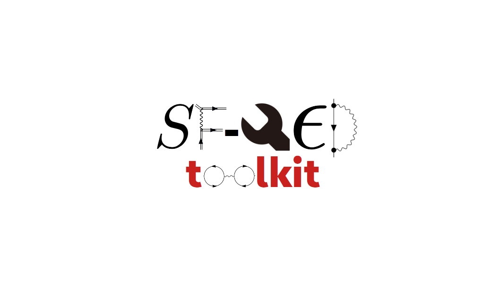

SFQEDtoolkit: a high-performance library for the accurate modeling of strong-field QED processes in PIC and Monte Carlo codes
=============================================================================================================================

[]

Introduction
------------

Strong-field QED (SFQED) processes such as high-energy photon emission and electron-positron pair creation are central in determining the dynamics of particles and plasmas in extreme electromagnetic fields such as those present in the vicinity of compact astrophysical objects or generated with ultraintense lasers. SFQEDtoolkit is an open source library designed to allow users for a straightforward implementation of SFQED processes in existing particle-in-cell (PIC) and Monte Carlo codes. SFQEDtoolkit is designed to provide users with high-performance and high-accuracy. Neat examples showing its usage can be found in the folders [example.cpp](https://github.com/QuantumPlasma/SFQEDtoolkit/tree/master/example_cpp) and [example_fortran](https://github.com/QuantumPlasma/SFQEDtoolkit/tree/master/example_fortran).

In the near future, SFQEDtoolkit will be enriched to model the angular distribution of the generated particles, i.e., beyond the commonly employed collinear emission approximation, as well as to model spin and polarization dependent SFQED processes.

Attribution
-----------

SFQEDtoolkit is a *scientific project*. If you **present and/or publish** scientific results that used SFQEDtoolkit, we ask you to set a **reference** to show your support. At present, this can be achieved by inquiring

- [REFERENCE.md](https://raw.githubusercontent.com/QuantumPlasma/SFQEDtoolkit/master/docs/reference.md)

or by simply adding

"S. Montefiori, M. Tamburini, arXiv:2301.07684, 2023"

to the references' list of your work. Thank you for your understanding and support!

Software License
----------------

*SFQEDtoolkit* is licensed under the **GPLv3+**.

********************************************************************************

Installation and Usage
----------------------

The steps listed below are meant to help users to successfully include SFQEDtoolkit into their Montecarlo or PIC code. SFQEDtoolkit can be used in both **C++** and **Fortran** codes and the instructions below contain, in between brackets, the programming language to which they refer. Before using SFQEDtoolkit you are strongly recommended to read the "Users manual" included in the appendix A of the above mentioned article, "S. Montefiori, M. Tamburini, arXiv:2301.07684, 2023", where all the main routines are introduced and described.

1. Copy the folders `src_SFQEDtoolkit` (required for **C++** and **Fortran**) and `src_fortran_wrapper` (only for **Fortran**), pasting them to the directory where your main code is located. In addition to this, you need either to copy the `coefficients` folder (boundled with SFQEDtoolkit), containing the Chebyshev coefficients approximating the core functions used by the library, or, alternatively, to export the environment variable `SFQED_TOOLKIT_USER` specifying the path to the directory where the `coefficients` folder can be found.  

2. Change your code using the functions made available by the toolkit (see appendix A of arXiv:2301.07684). The library is thought to be used only through the functions that are made available in the `SFQEDtoolkit_Interface.hpp` header file (for **C++**) or in the `SFQEDtoolkit_Interface.f90` source file (for **Fortran**). However you are completely free to bypass this "self-imposed restriction" and use the library as you please. Examples of its usage are shown inside the `example_cpp` (**C++**) or `example_fortran` (**Fortran**) folder provided with the library (so please have a look!).

3. Compile your code and SFQEDtoolkit together: (**C++**) -> if you have a `makefile` this is easily done by adjusting it (so to include the content of the `src_SFQEDtoolkit` folder to your compilation path) and running `make`, otherwise you can always proceed in the old-fashioned way, by compiling and linking everything through the command line; (**Fortran**) -> same as in the **C++** case. Additionally, it is important to compile the content of the `src_fortran_wrapper` directory before compiling the files where the library is used.

4. To test SFQEDtoolkit, you may apply the instructions above to the examples (`example_cpp` and `example_fortran`) we provided. Actually, when dealing with these examples, you can skip point 2 of this instructions list, as we already took care of it for you. Of course if you want to do some changes you are more than welcome to explore.

Software Upgrades
-----------------

Currently the library is in its first stable release.

Active Developing Team
----------------------

### Supervision

- Dr. Matteo Tamburini

### Maintainer and core developer

- Samuele Montefiori

********************************************************************************
